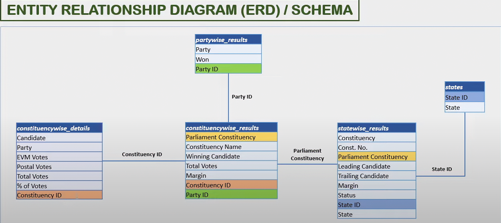
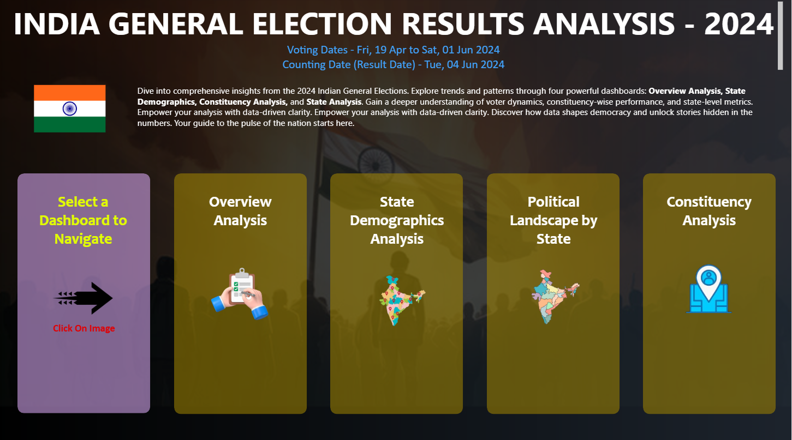
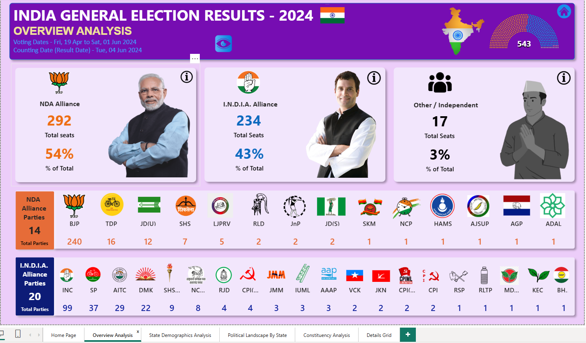
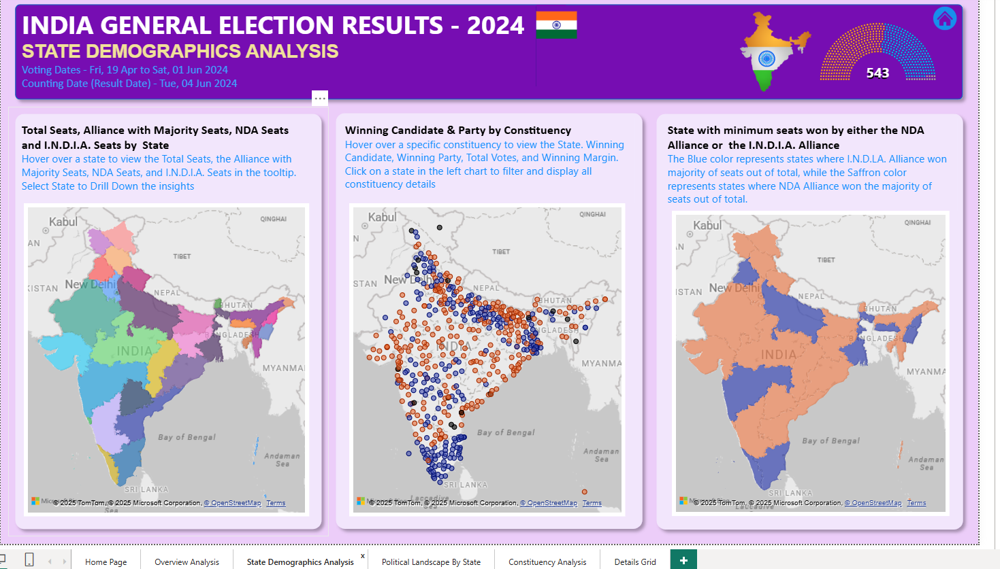
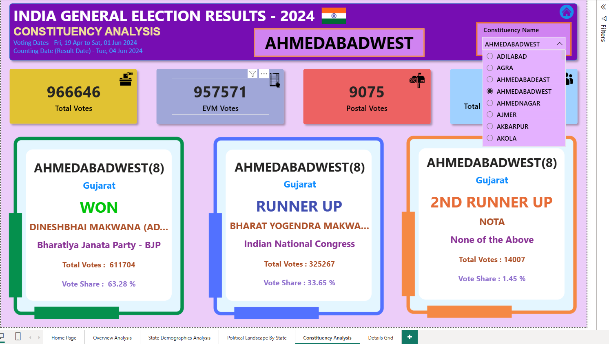
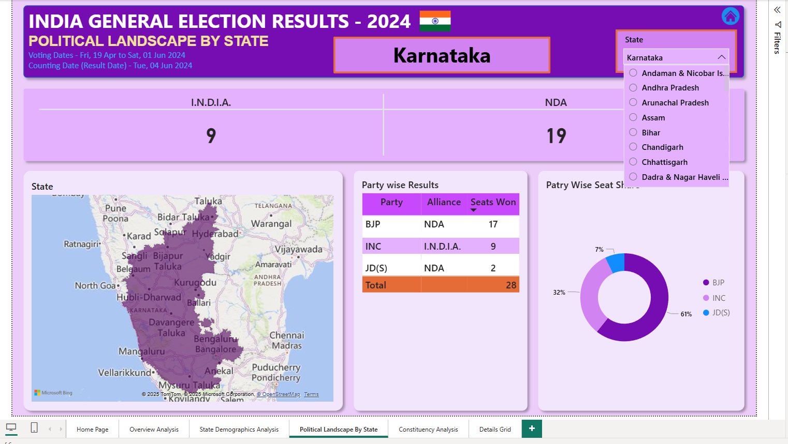
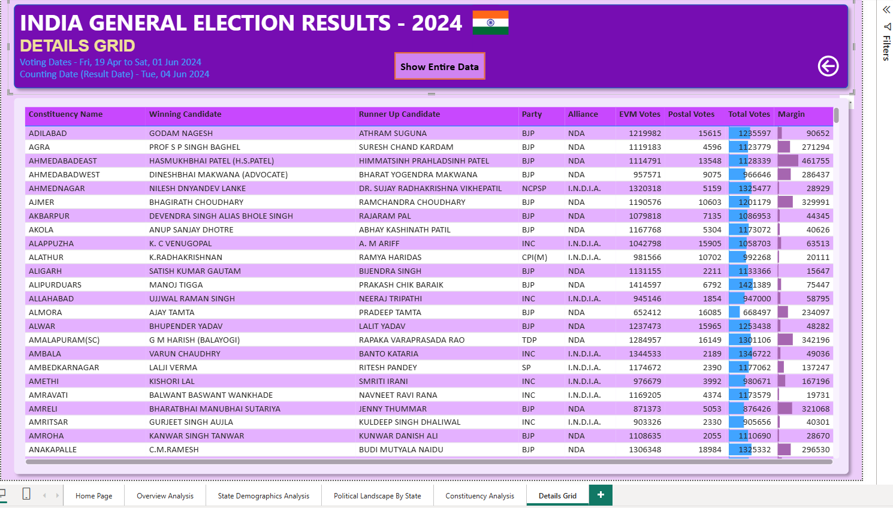

# General-Election-Analysis
This project visualizes and analyzes the 2024 Indian General Election results using Power BI. It covers alliance-wise performance, state-level results, constituency breakdowns, and demographics.

## EDR

## Dashboards Included
1. Home
    
   
3. Overview Analysis
   
   
4. Political Landscape by State
   
   
5. Constituency Analysis
     
   
6. State Demographics Analysis
    
   
7. Details Grid
     

## Questions (KPIs)
1.How many total seats did each political party win in the 2024 General Elections?
2.Which alliance (NDA, I.N.D.I.A, Others) secured the highest number of seats overall?
3.What is the vote share percentage of each major political party across India?
4.Which state recorded the highest number of seats won by a single party?
5.Which candidate had the highest margin of victory in their constituency?
6.Which 5 constituencies witnessed the closest elections (smallest winning margin)?
7.What is the total number of votes received by each party nationwide?
8.How many female candidates won compared to male candidates?
9.In how many constituencies did NOTA receive more than 5% of the total votes?
10.Which state had the highest voter turnout percentage?
